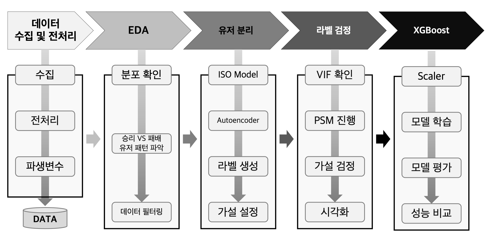

<h1>리모델링이 주택 가격에 미치는 영향 분석</h1>

**💭 Language : Python**

**🛠 Tool : Google Colab, Jupyter Notebook**

**📅 진행기간 : 2025.10 ~ 2025.11**

**👥 인원 : 개인 프로젝트**

---------------------------------------------------------------------------------

# 프로젝트 개요

- 주택 리모델링이 판매 가격에 미치는 영향을 다각도로 분석하여, 리모델링의 실질적인 가치 상승 기여도를 정량적으로 평가하는 것이 목표
- 리모델링 여부, 경과 시간, 지역 특성 등 다양한 요인을 고려하여 리모델링 투자 전략에 대한 인사이트 도출

  

# 프로세스

 

  

# 데이터 개요

- **데이터 소스**: Kaggle (House Prices - Advanced Regression Techniques)
- **주요 컬럼**:
    - `SalePrice`: 주택 판매 가격 (종속 변수)
    - `YearBuilt`: 건축 연도
    - `YearRemodAdd`: 리모델링 연도
    - `Neighborhood`: 지역
    - `OverallQual`: 전반적인 주택 품질
    - `GrLivArea`: 지상 생활 면적
    - `TotalBsmtSF`: 지하실 면적

  

# 데이터 전처리

- `MSSubClass` 컬럼을 수치형에서 범주형으로 변환
- `YearRemodAdd`와 `YearBuilt`가 동일한 경우 리모델링을 하지 않은 것으로 간주하여 `Remodel_Label` (0: Not Remodeled, 1: Remodeled) 컬럼 생성
- 리모델링 그룹 (696개)과 비 리모델링 그룹 (764개)으로 분리, 클래스 불균형 없음 확인

  

# 파생 변수 생성

- `Remodel_Label`: 리모델링 여부 (0 또는 1)
- `Elapsed_Years`: 리모델링 후 경과 시간 (`YrSold` - `YearRemodAdd`)

  

# EDA

### 리모델링 여부에 따른 SalePrice 시각화

- 리모델링 여부에 따른 판매 가격(`SalePrice`)의 분포와 차이를 박스플롯, 바이올린 플롯, 히스토그램 등으로 시각화
- 특히 고가 주택에서 리모델링 효과가 더 두드러지는 경향 확인

### Mann-Whitney U Test

- 리모델링 그룹과 비 리모델링 그룹 간 `SalePrice`의 통계적 유의미한 차이 검증 (p-value = 0.0011)
- 효과 크기(r-value) 계산을 통해 차이의 실질적 영향력 평가

### 지역별 리모델링 현황

- 지역별 평균 판매 가격 및 리모델링 그룹/비 리모델링 그룹의 판매 가격 분포 비교
- Kruskal-Wallis Test를 통해 지역별 리모델링 여부가 판매 가격에 미치는 영향 분석
- 리모델링 효과가 뚜렷한 지역일수록 높은 판매 가격을 형성하고 있음을 시사

  

# 시계열 분석

- `Elapsed_Years` (리모델링 후 경과 시간)에 따른 평균 판매 가격 변화 추이 분석
- 경과 시간 구간화 (`단기(0~5년)`, `중기(5~15년)`, `중,장기(15~30년)`, `장기(30~50년)`, `초장기(50년 이상)`)를 통해 시간 흐름에 따른 리모델링 효과의 지속성 평가
- 리모델링 후 경과 시간이 길어질수록 평균 판매 가격이 낮아지는 경향 확인
- OLS 회귀 분석 결과, 경과 시간이 증가할수록 판매 가격이 감소하는 유의미한 관계 확인 (p < 0.05)
- 잔차 분석 결과, OLS 모델의 정규성 및 등분산성 가정이 충족되지 않아 모델 신뢰도 낮음

  

# 회귀 모델링

### 모델 선정 및 평가

- `RandomForestRegressor`, `XGBoostRegressor`, `GradientBoostingRegressor`, `LGBMRegressor` 4가지 모델 후보 선정
- K-Fold Cross Validation (K=5)을 통해 RMSE 기준으로 모델 성능 비교
- `GradientBoosting`과 `LGBM` 모델이 우수한 성능을 보임

### 하이퍼파라미터 튜닝

- `GradientBoostingRegressor`와 `LGBMRegressor`에 대해 GridSearchCV를 사용하여 최적 하이퍼파라미터 탐색

### 최종 모델 선정 (앙상블)

- 튜닝된 `GradientBoosting`과 `LGBM` 모델의 예측값을 단순 평균 앙상블하여 최종 모델로 선정
- 앙상블 모델이 개별 모델보다 모든 평가 지표 (RMSE, R², MAE)에서 가장 우수한 성능을 나타냄

### SHAP 분석

- 앙상블 모델에 대한 SHAP 분석을 통해 각 변수의 `SalePrice` 예측에 대한 기여도 분석
- `OverallQual` (주택 품질), `GrLivArea` (지상 면적), `TotalBsmtSF` (지하실 면적), `YearRemodAdd` (리모델링 연도), `YearBuilt` (건축 연도) 등이 `SalePrice`에 큰 영향을 미치는 주요 변수임을 확인
- `Remodel_Label` 또한 유의미한 영향을 미치지만, 다른 주요 변수들에 비해 기여도가 상대적으로 낮음

  

# OLS 회귀 분석

- 전체 데이터 및 리모델링 그룹에 대해 OLS 회귀 분석 수행
- `Remodel_Label` (리모델링 여부)과 `YearRemodAdd` (리모델링 연도)가 통계적으로 유의미한 변수로 확인
- `Elapsed_Years` (리모델링 후 경과 연수)가 증가할수록 가격이 하락하는 경향이 다시 확인됨
- 리모델링 효과는 단기적으로 존재하나, 시간이 지날수록 그 효과가 감소하는 것으로 해석

  

# 최종 결과

1.  **리모델링 효과**: 리모델링은 주택 가격 상승에 통계적으로 유의미한 영향을 미치며, 특히 리모델링 연도가 최근일수록 가격 상승 효과가 뚜렷하게 나타남.
2.  **시간 경과에 따른 영향**: 리모델링 후 경과 시간이 길어질수록 판매 가격이 감소하는 경향이 있음.
3.  **주요 영향 변수**: 주택 품질(`OverallQual`), 지상 면적(`GrLivArea`), 지하실 면적(`TotalBsmtSF`)이 가격에 가장 큰 영향을 미침.
4.  **투자 전략**: 리모델링을 통해 가격 상승 효과를 극대화하려면, 고품질 주택이 밀집된 고가 지역에서 리모델링을 실행하는 것이 더 효과적임.

  

# Lesson and Learned

-   **다각도 분석의 중요성**: 리모델링이 주택 가격에 미치는 영향을 다각도로 분석하면서, 전반적인 EDA 과정과 논리적인 흐름으로 분석을 수행할 수 있었음.
-   **변수 중요도**: 단순한 리모델링 여부보다 연도와 주택 품질이 주택 가격에 중요한 영향을 미친다는 점을 데이터 기반으로 검증할 수 있었음.
-   **데이터 한계**: 데이터 row 수가 1064개로 제한적이었고, 리모델링 전후의 개별 주택 데이터를 비교할 수 없었다는 점이 가장 큰 아쉬움.
