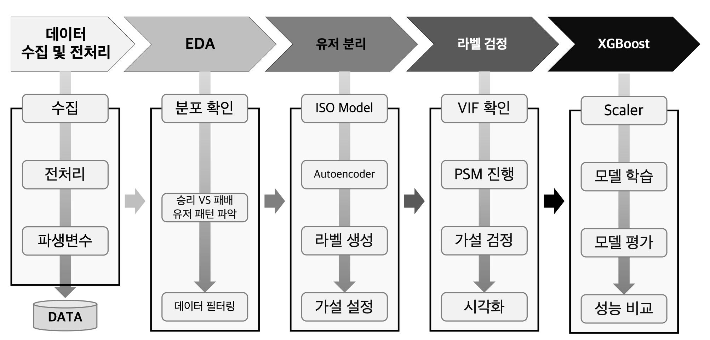
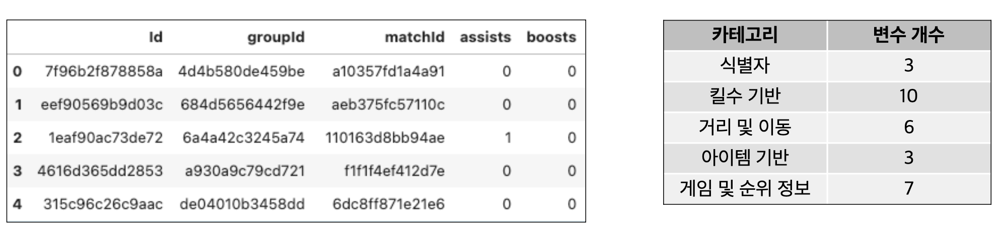
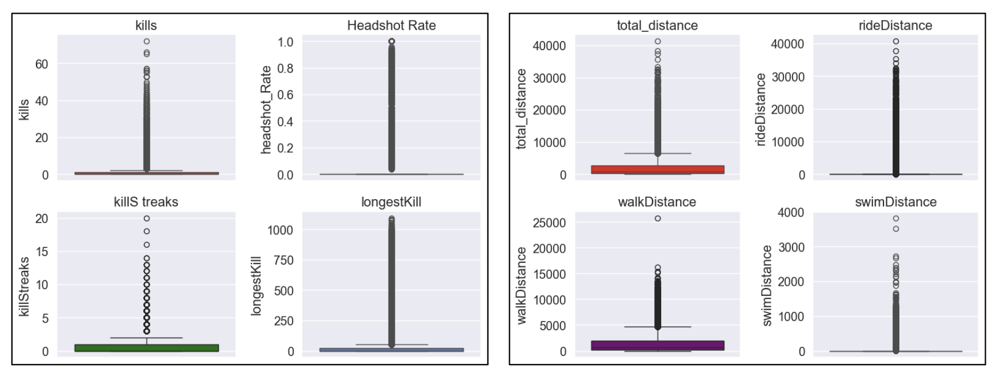
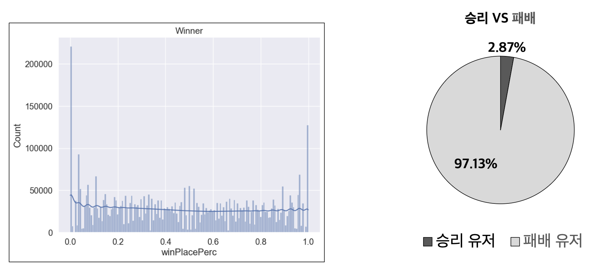
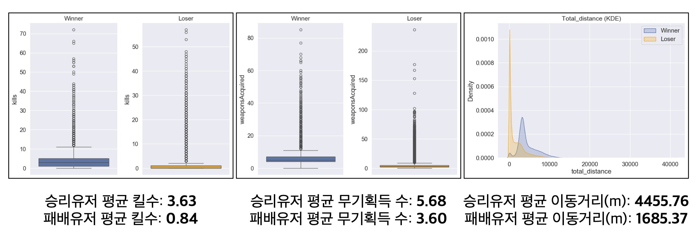
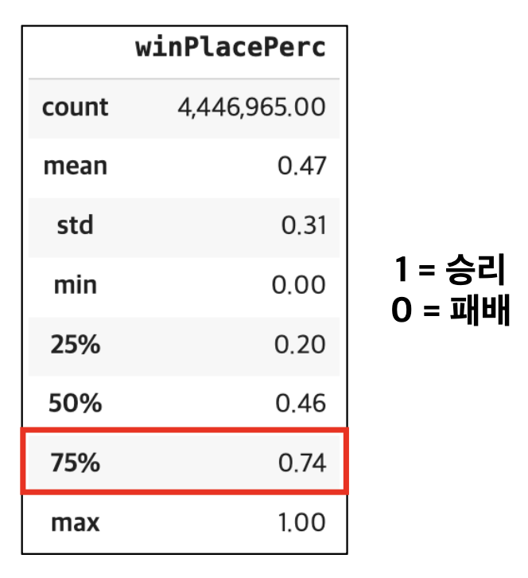
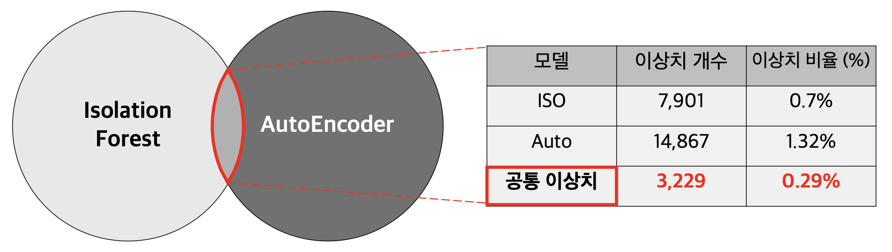
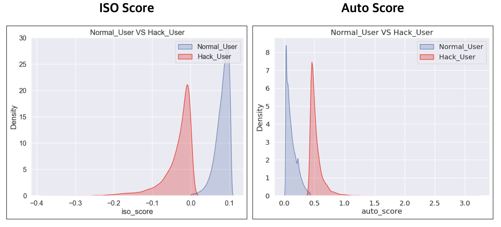
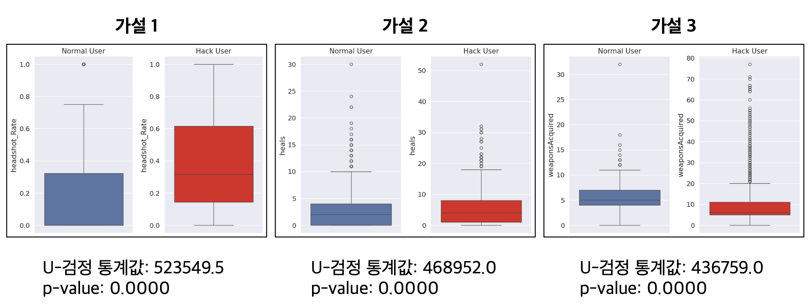
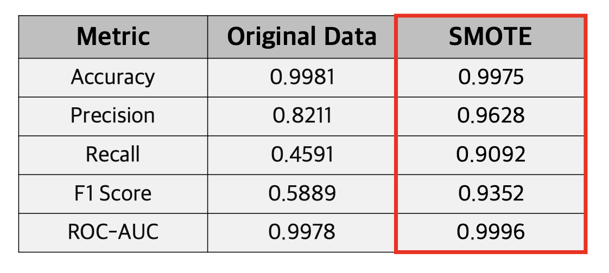

<h1>배틀그라운드 핵/버그 유저 탐지 및 분석</h1>

**💭 Language : Python**

**🛠 Tool : Google Colab, Jupyter Notebook**

**📅 진행기간 : 2025.10 ~ 2025.11**

**👥 인원 : 개인 프로젝트**

---------------------------------------------------------------------------------

# 프로젝트 개요

- 온라인 게임에서는 핵/버그 사용자들이 공정한 게임 플레이를 방해하고, 게임 경험을 저해하는 문제가 발생
- 이로 인해 게임 유저들의 불만이 증가하고, 게임 생태계에 악영향을 끼친다
- 핵/버그 사용자를 효과적으로 탐지, 제재함으로써 공정성을 유지하고, 사용자 경험을 향상시키는 것이 목표
- 이상치 라벨이 없는 상황에서 비지도 학습과 지도학습을 조합한 하이브리드 접근법 적용

  

# 프로세스

 

  

# 데이터 수집

 

- **[Kaggle](https://www.kaggle.com/)** 에서 배틀그라운드 유저 데이터 수집
- **수집 결과: 4,446,966 rows × 29 columns** 

  

# 데이터 전처리

| 컬럼명 | 설명 |
|--------|------|
| matchId | 경기를 식별하는 ID |
| numGroups | 그룹 수 |
| maxPlace | 경기 내 최악의 순위 |
| matchDuration | 지속 시간(시계열 X) |
| killPlace | 킬 순위 |
| vehicDestroys | 차량 파괴 횟수 |
| killPoints | 처치 기반 순위 |
| winPoints | 승리 기반 외부 순위 |

 

- 이상치탐지에불필요한데이터제거(순위,점수기반)
- ”rankPoints” 컬럼에-1값의수:1,701,810
- ”rankPoints”
- 1을0으로대체
- 총 **8개의columns 제거**

  

# 파생 변수 생성

| 변수명 | 설명 | 계산식 |
|--------|------|--------|
| total_distance | 총 이동거리 | walkDistance + rideDistance + swimDistance |
| headshot_Rate | 킬 수 대비 헤드샷 | headshotKills / kills |
| kills_per_distance | 킬 수 대비 이동거리 | total_distance / kills |

 

- 총이동거리,헤드샷비율,이동거리대비킬수생성
- total_distance =walkDistance + rideDistance + swimDistance
- headshot_Rate = headshotKils / kils
- kils_per_distance = total_distance / kils
- 최종:24columns

  

# EDA

### 전체 분포

 

- 위 변수들의 분포 확인 결과 0값이 대부분의 분포를 차지하고 있음을 나타냄
- 즉, 전체 데이터는 정규분포가 아닌 비정규 분포 형태를 띄고 있음

 

### 승리 유저

 

- **승리 유저 비율**: **2.87%**
- **패배 유저 비율**: 97.13%
- 승리 유저는 데이터에서 **매우 적은 비중을 차지**
- 핵 사용자는 **핵을 활용하여 승리를 도모했을 가능성이 높다고 가정**하여, 각 유저 간의 행동 패턴을 비교 분석

 

### 승리 VS 패배 유저 비교

 

- 승리 유저의 데이터가 수적으로 적음에도 불구하고, 패배 유저보다 높은 평균값을 보임

 

### 승리 점수 기반 전처리

- 분석 결과 승리 유저의 패턴이 핵 사용자와 비슷할 것으로 나타남
- 그렇기에 승리 유저들만을 대상으로 분석을 고려했으나
- 이는 전체 데이터의 2.87%에 불과하여 데이터 손실을 초래
- 하여 승리 점수 값의 3분위수인 0.74 이상을 기준으로 범위 조정
    - 전체 데이터 중 전처리 데이터 비율: **74.62%**
    - 전체 데이터 중 최종 데이터: **1,128,703(25.38%)**

  

# 비지도 학습

 

- **label**이 없기에 비지도 학습 기반 모델인 **Isolation Forest, AutoEncoder** 모델을 활용해 분리
- 두 모델에서 이상치로 식별된 데이터 중 **공통 이상치(교집합)**에 해당하는 데이터를 **핵 유저로 정의**

 

### 모델 학습(공통)

- **Scaler** : 데이터가 **비정규분포** 형태를 보이고, 이상치의 영향을 최소화하기 위해 **RobustScaler**를 적용
- **변수 제거** : **rideDistance** 변수는 총 이동거리 변수와 **상관관계(0.9)가 높아 다중공선성을 방지**하기 위해 제거

 

### 모델 평가(간접)

 

- **ISO** Model : **음수 Score**영역이 클수록 **이상치로 탐지**
- **Auto** Model: 재구성 오류를 기반으로 하여 재구성 오류가 클수록 **이상치로 탐지**
- **평가**
    - 두 모델 모두 이상치를 탐지했으나, 완벽한 분리라고 보기는 어려움
    - 실제로 이상탐지의 목표가 완벽한 분리보다는 탐지하는데 있다는 점에서 괜찮은 성능이라고 판단

 

# 통계적 검정

### 가설 설정
- **가설1** : 핵 사용자들은 일반 사용자 보다 **헤드샷 비율이 높을 것이다.**(정확한 에임 핵을 사용)
- **가설2** : 핵 사용자들은 일반 사용자 보다 다르게 **무기 획득 수가 많을 것이다.**(스피드 핵 사용)
- **가설3** : 핵 사용자들은 일반 사용자 보다 **힐 아이템 사용이 많을 것이다.**(스피드 핵, 월핵 등 사용)

 

### 가설 검정

- 목적: 생성된 라벨의 신빙성을 검증하고, 그룹 간 통계적 차이를 확인

1. **VIF 확인** : PSM 과정에서 로지스틱 회귀를 사용하여 점수를 계산하기 떄문에 다중공선성 문제를 확인
2. **PSM(성향 점수 매칭)**: 그룹 간 샘플 크기 불균형 해소 및 혼란 변수를 줄이기 위한 데이터 정제
3. **U-Test(가설 검정)**: **p-value** 값이 **0.05** 이하여야 그룹 간 통계적 의미가 유의미

 

  

# 최종 모델

### XGBoost 모델 설정
- **목적** : 앞서 모델을 통해 생성된 라벨을 바탕으로, 핵/일반 유저의 행동 패턴과 특징을 학습하여 성능 평가
- **Scaler** : 데이터가 비정규분포 형태를 보이고, 이상치의 영향을 최소화하기 위해 **RobustScaler**를 적용
- 핵 유저의 극소수 비율(0.29%) 문제를 해결하기 위해 **SMOTE** 기법을 사용하여 2%로 늘려서 성능 비교

 

### 주요 성과
- **SMOTE 적용 후 Precision 향상**: 82.11% → **96.28%**
- **Recall 대폭 개선**: 45.91% → **90.92%**
- **F1 Score 크게 향상**: 58.89% → **93.52%**
- **ROC-AUC 최고 성능**: **99.96%** 달성

  

# 기대효과 및 Lesson and Learned

## 기대효과
- **게임 공정성 향상**: 핵/버그 사용자를 효과적으로 탐지하여 공정한 게임 환경 조성
- **사용자 경험 개선**: 핵 사용자 제재를 통한 일반 사용자들의 게임 만족도 향상
- **자동화된 탐지 시스템**: 실시간으로 이상 행동 패턴을 탐지하는 자동화 시스템 구축 가능
- **게임 생태계 건전성**: 장기적으로 게임의 지속성과 커뮤니티 건강성 증진

## Lesson and Learned
- **하이브리드 접근법의 효과성**: 비지도 학습으로 라벨을 생성하고 지도학습으로 성능을 향상시키는 방법의 유효성 확인
- **클래스 불균형 해결의 중요성**: SMOTE 기법 적용을 통해 극심한 클래스 불균형 문제를 효과적으로 해결하고 성능 개선 경험
- **통계적 검증의 필요성**: PSM과 가설검정을 통한 라벨 신뢰성 검증이 모델의 설득력을 높이는 데 중요함을 학습
- **도메인 지식의 중요성**: 게임 내 핵 사용 패턴에 대한 이해를 바탕으로 한 가설 설정과 특성 엔지니어링의 중요성 체감