# AI 부트캠프 13기 ML경진대회 3조

## 0. Overview
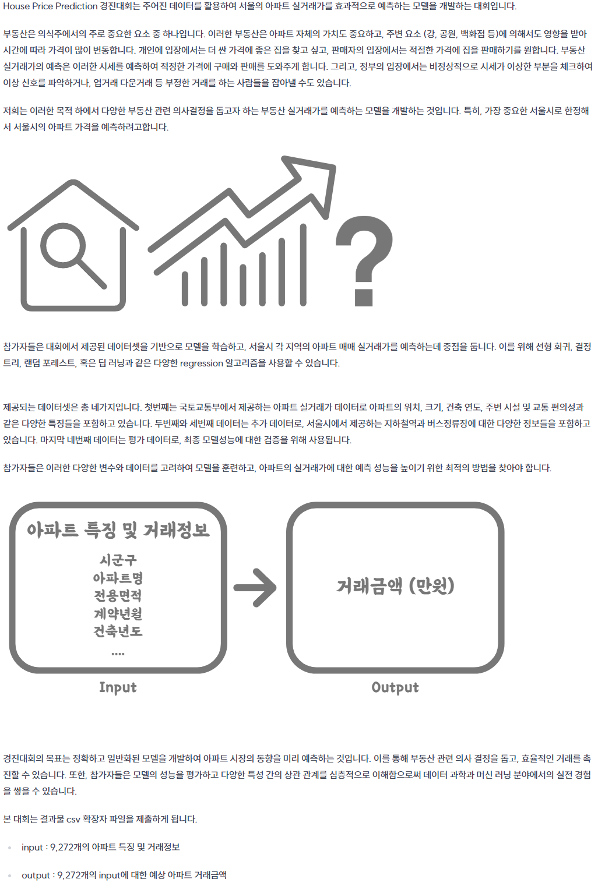


## 1. Competiton Info

### Timeline
- 2025.05.01 - 2025.05.15

## 2. Components

### Directory

- _Insert your directory structure_

e.g.
```
├── code
│   ├── jupyter_notebooks
│   │   └── model_train.ipynb
│   └── train.py
├── docs
│   └── pdf
│        └── (Template) [패스트캠퍼스] Upstage AI Lab 13기_그룹 스터디 .pptx
│   
└── data
    ├── eval
    └── train
```

## 3. Data descrption

### Dataset overview

- _Explain using data_

### EDA
- 자치구별 평균 아파트 거래가
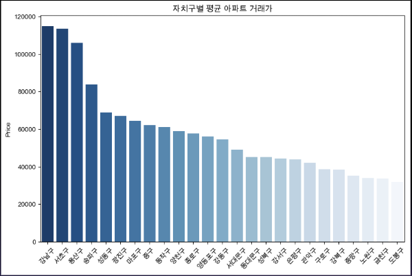
- Top30 아파트 브랜드별 평균 거래금액
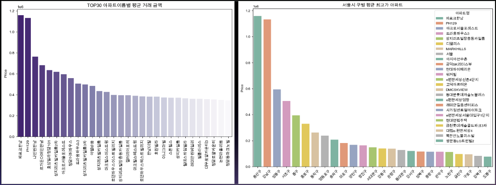
- 브랜드 vs 일반 아파트 실거래가 분포
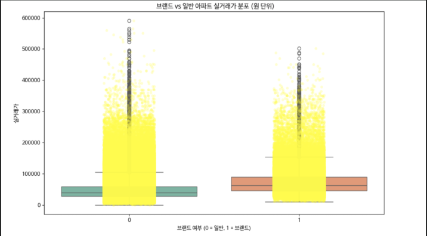
- target_분포도_층_산점도
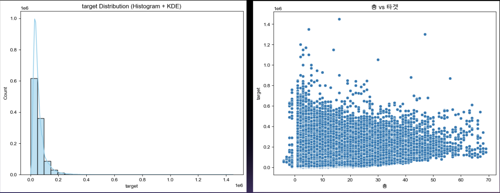
- 구별 아파트 가격 Boxplot 계약년월 변화
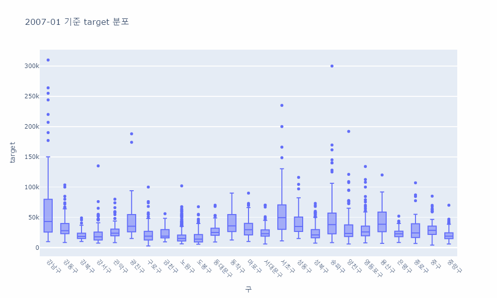
- 건물연령대별 및 주요 3개 시군구별 가격 분포
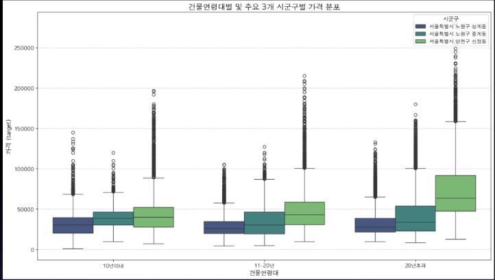
- 대출금리별 아파트 가격 & 거래 밀도
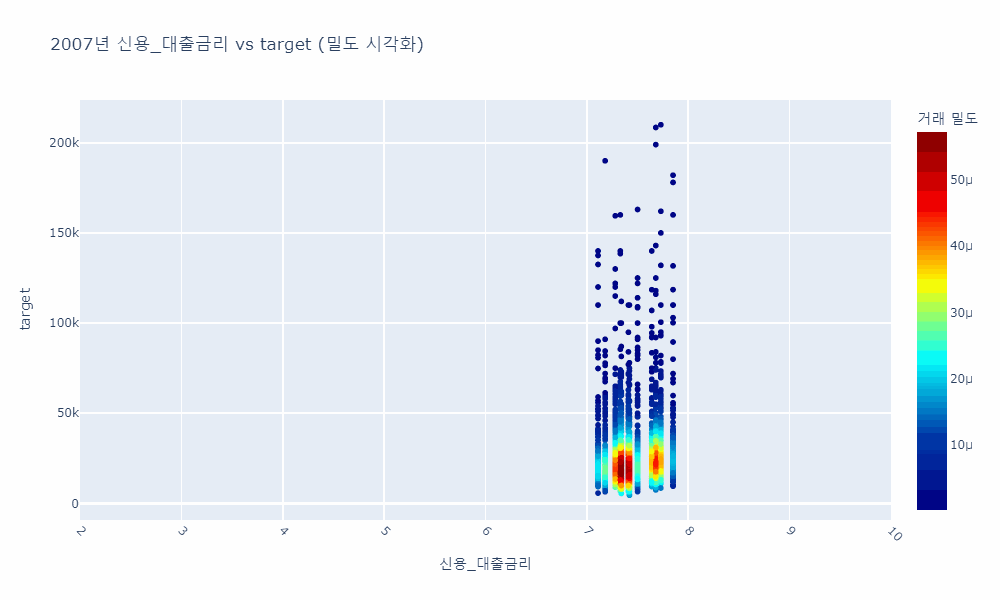
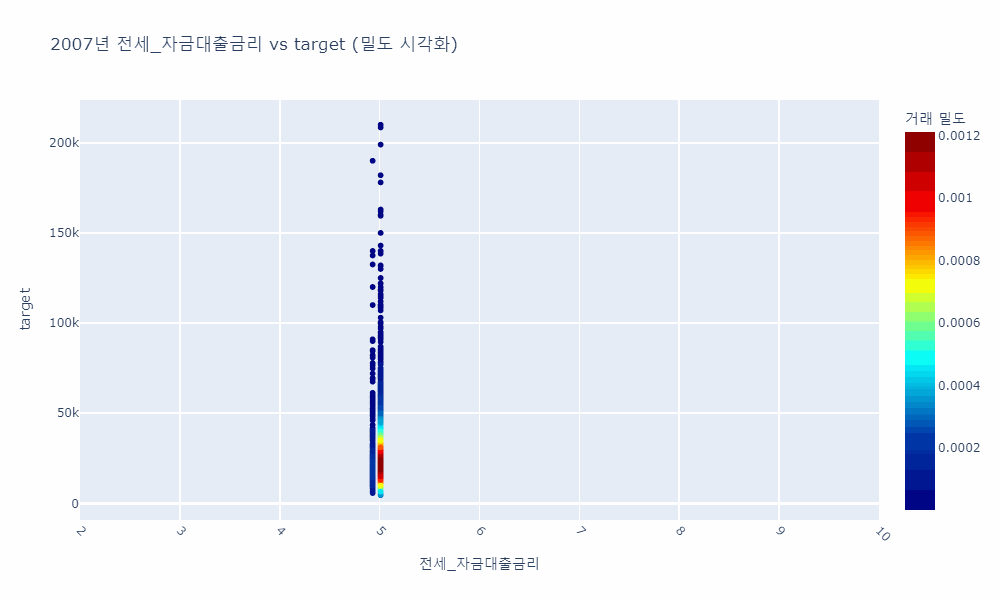

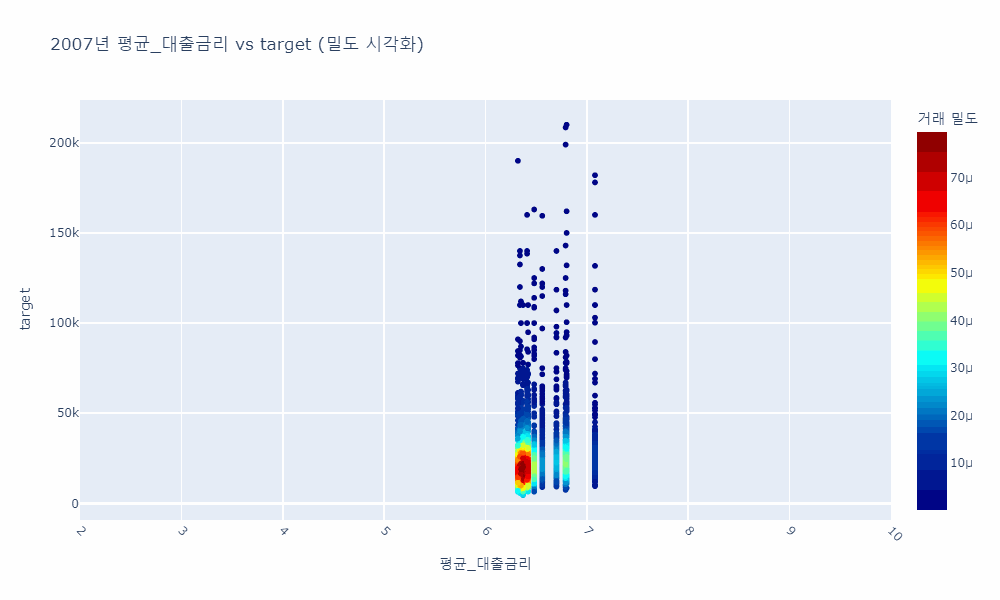
- 평균 대출금리 구별 아파트 가격 & 거래 밀도
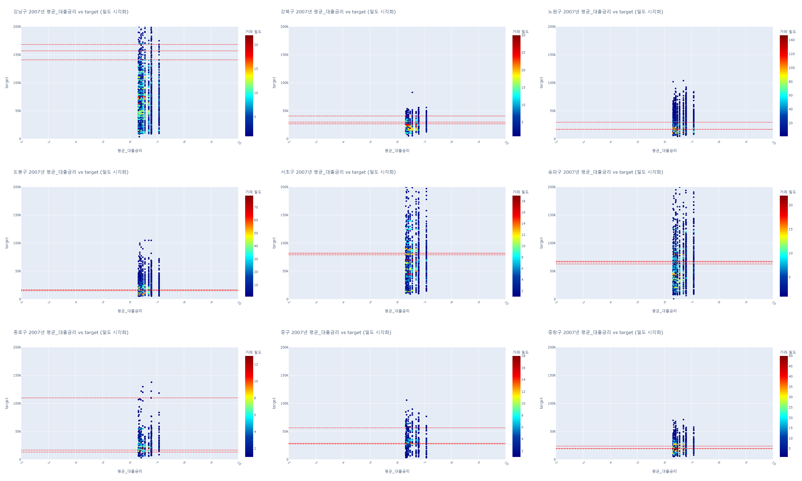
- spearman 상관계수
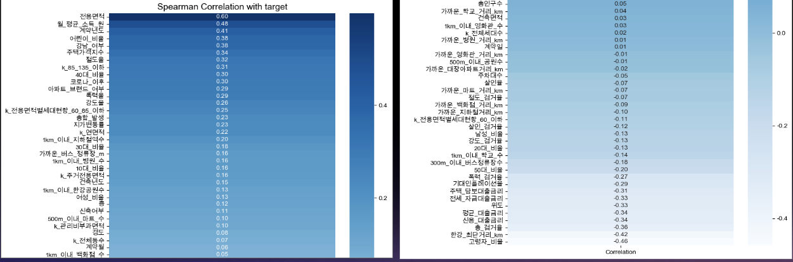

### Feature engineering
- Mutual Information 중도가 낮은 변수들만을 교집합 으로 타겟 예측에 기여하지 않은 피처들 제거
  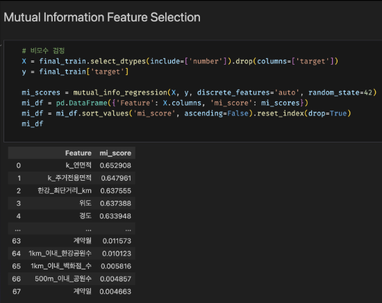
- 범주형 최빈값 비모수 검정으로 범주형 변수들 유의성 확인


### Data Processing

- _Describe data processing process (e.g. Data Labeling, Data Cleaning..)_

## 4. Modeling
- 문국현
  - 검증셋 분할 방법 : TimeSeriesSplit 사용
  - 이유: Test Data엔 2023년 7~9월까지 데이터만 있다.
  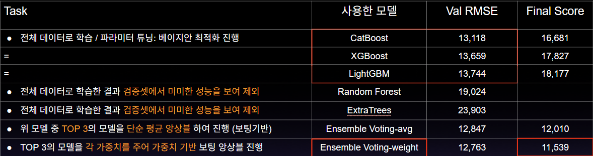
- 조선미
  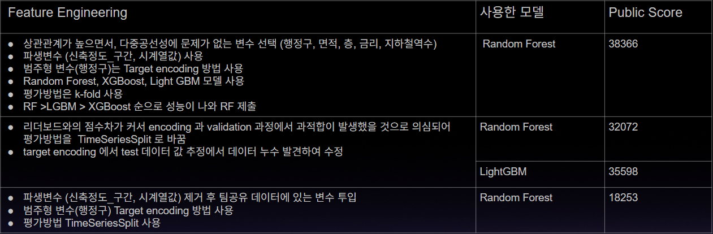
  - Feature importances : 전용면적, 건축년도, 계약년도, 가까운 대장 아파트 거리, 1km 이내 병원수, 가까운 백화점 거리, 가까운 지하철거리
  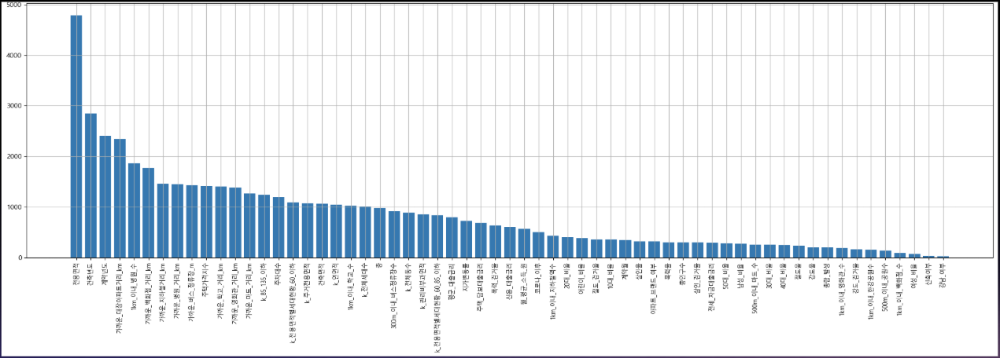
- 홍정민
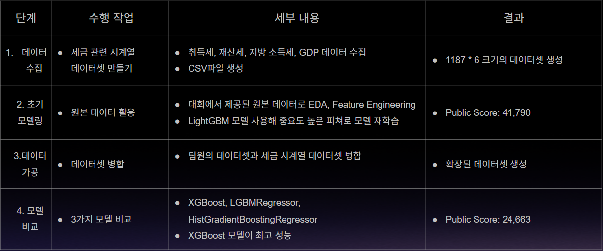
- 이승민
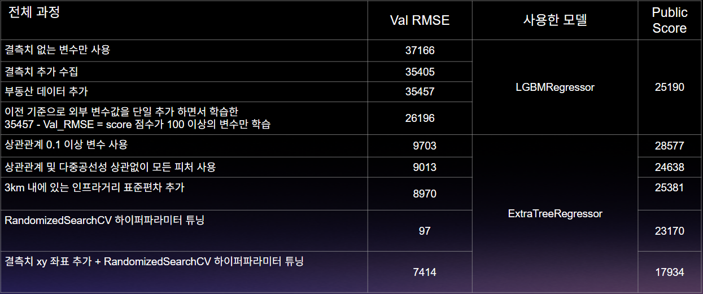
- 문진숙
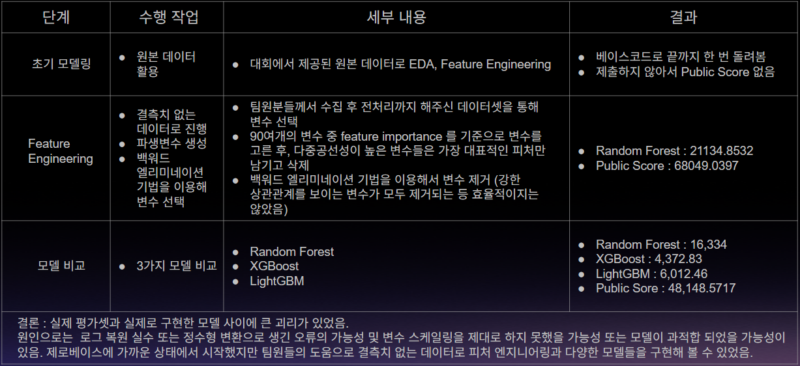
  - SHAP


### Model descrition

- _Write model information and why your select this model_

### Modeling Process

- _Write model train and test process with capture_

## 5. Result

### Leader Board

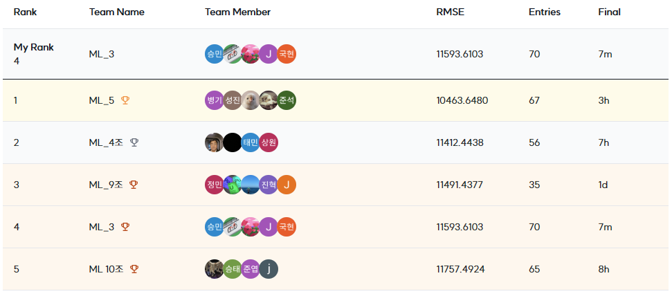
- 4th, Public Score : 11593.6103